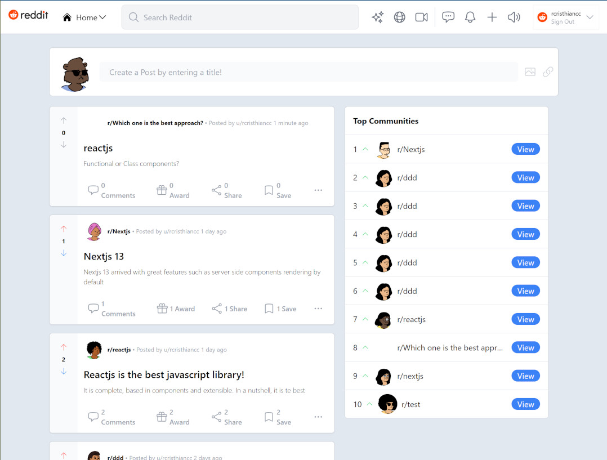

# Reddit Clone made with Next.js + Tailwind CSS

Reddit-like portal. App similar to reddit UI that simulates the process of posting, commenting and voting reddits. Users can log in using their Reddit account through Next-auth and start posting or commenting reddits. Once logged in, users can post new reddits, comment, and vote like as if they were using reddit.

See it in action: <a href="https://reddit-react-rccc7.vercel.app/" target="_blank">https://reddit-react-rccc7.vercel.app</a>

## Screenshots:

<div align="center">
  
</div>

## Technologies
The following technologies, components and services were used:

- React.js
- Next.js
- [Heroicons](https://github.com/tailwindlabs/heroicons)
- [Next Auth](https://next-auth.js.org/getting-started/example): Users can login the app using their reddit account.
- [Reddit provider](https://next-auth.js.org/providers/reddit) for Next.js.
- [Reddit API](https://www.reddit.com/dev/api/).
- [Supabase](www.supabase.com) postgresql database.
- [Stepzen & Graphql](https://stepzen.com/) to access and interact with the postgreSQL database through graphql.
- [Apollo Client](https://www.apollographql.com/blog/apollo-client/next-js/next-js-getting-started/) to manage data data with graphql from the react app.
- [React-Hook](https://react-hook-form.com/) which is a hook that allows us to optimize the form management by reducing the amount of code needed to write while removing unnecessary re-renders.
- [React-hot-toast](https://react-hot-toast.com/docs) which brings beautiful notifications and easy to use functionality in our React app.
- [UI ball Loaders](https://uiball.com/loaders/) which provides free loaders and spinners when we want to wait for asynchronous processes.

## Disclaimer

This is just a demo project with the intention of test and practice with the latest Next.js framework feactures for React and for testing and the [Reddit API](https://www.reddit.com/dev/api/) & [Reddit provider](https://next-auth.js.org/providers/reddit) features. 

## Step by Step Setup & Deployment Instructions from scratch:

1. To install the nextjs with tailwind follow the instructions here:
	https://tailwindcss.com/docs/guides/nextjs#
But with a slight modification in which we define the react-version (12.3)
 and add the example parameeter to download with the tailwindcss template: 
 	```bash
	npx create-next-app -e with-tailwindcss reddit-react
	cd reddit-react
	npm uninstall next
	npm i next@12.3
	```
2. Install VSCode GraphQL extension to add syntax highligting and validation for graphql
3. Install heroicons, see more info at: https://github.com/tailwindlabs/heroicons
	```bash
    	npm install @heroicons/react
	```
4. Install next-auth. See instructions at: https://next-auth.js.org/getting-started/example
	```bash
	npm install next-auth
	```
5. To use the reddit provider follow the instructions at: https://next-auth.js.org/providers/reddit to create a new reddit app and enable the auth functionality. The fields to fill are:

	Name: educational react clone
	redirect uri: http://localhost:3000/api/auth/callback/reddit --> which is gonna be updated when deploying to vercel.
	Once created the applciation copy the webapp ID and secret values and paste them in the env.local config file.
	The next step is to wrap the entire app (_app.tsx) inside the SessionProvider provider, which allows to use the session and hooks from next-auth.
6. Configure the supabase database:
	- Go to supabase.com, signIn and/or create an account. In this case we're going 
	to sign In with github account.
	- Set up the postgres DB:
		- Create a new project an name it reddit-react and assign it a string password.
		- Create the post, comment, vote, and subreddit tables.
7. Configure StepZen to access database through graphql:
	- Go to stepzen.com and create a free account by signing in with github as well.
	- Follow the instructions to install the required dependencies:
		```bash
		npm install -g stepzen
		```
	- To login with the new account use the following command:
		```bash
		stepzen login -a wertheim
		```
		* when asked for the admin password, enter the admin key that stepzen provides.
	- Use the provided API Key when needed (go to StepZen account to get the API key)
	- Create the folder stepzen at the root of this project.
	- Initialize StepZen:
		```bash
		ct stepzen
		stepzen init
		```
		👆🏻👆🏻👆🏻 (when asked: "What would you like your endpoint to be called?" 
		|--> Accept the sugestion by pressing enter)
		This command created the file stepzen.config.json inside the stepzen diectory.

	- For more detailed information go to this link: https://stepzen.com/docs/quick-start/install-and-setup
	- Now, in order to implement the PostgreSQL backend run the following command inside the stepzen directory:
		```bash
		stepzen import postgresql
		```
		👆👆👆 This command starts creating a GraphQL API that connects the
		 data from your PostgreSQL database. For more info go to https://stepzen.com/docs/quick-start/with-database-postgresql
		 The folder postgresql and index.graphql file inside that folder, which contains the graphql types 
		 (based on the tables already registered on supabase), inside that folfer were automatically created.
		 The file index.graphql was also created automatically.
	- To fill the required information go to supabase - settings - Database -> Then in that view scroll down to "Connection Info" and copy the  credentials described there: Host, db name, port, user, password.
	- To deploy and run the generated GraphQL schema for your database to StepZen run the following command:
		```bash
		setpzen start
		```
	- Now that we deployed to setpZen we can test our graphql queries at: http://localhost:5001/api/wistful-horse which is a graphiql like interface.
8. Configure apolloclient for nextjs. We can follow the specific instructions for nextjs at: https://www.apollographql.com/blog/apollo-client/next-js/next-js-getting-started/
	-Create the file apollo-client.js at the root level. Inside this file we could use
	the example detailed in the link above 👆👆👆
	- Install apollo client as well as graphql:
		```bash
		npm install @apollo/client graphql
		```
	- Obtain the API key (after having installed and configured stepzen 
    as described lines above) we execute the command
    	```bash
    	 stepzen whoami --apikey 
	 ```
    then copy the api key and paste in the env.local file by assigning to the NEXT_PUBLIC_STEPZEN_KEY variable
9. Configure the NEXTAUTH_SECRET AND NEXTAUTH_URL variables in the env.local file.
10. Install react-hook form. For more info go to: https://react-hook-form.com/
	```bash
	npm install react-hook-form
	```
11. Edit the postgresql/index.graphql file and remove or comment the created_at parameter at insertPost mutation because we don't need to send that info.
 11.1 Create the folder graphql at the root of the project inside which we'll create the queries.ts and mutations.ts files.
12. Install react hot toast : https://react-hot-toast.com/docs
	```bash
	npm install react-hot-toast
	```
13. Create the file typings.d.ts in which we'll define the typescript types to be used along the application. These types will be compatible with the graphql types defined in their corresponding graphql files.
14. Install react-timeago to show how long the user posted a reddit
		```bash
		npm i react-timeago
		```
15. Install loaders UI ball (for more info go to: https://uiball.com/loaders/)
	```bash
	npm install @uiball/loaders
	```
16. Create the repository reddit-react in github, then add the project to the repository.
17. Upload to Vercel by first creating a new project and then adding  the evironment variables stored in the .env.local file with the exception in this one:
	- NEXTAUTH_URL=http://localhost:3000 --> jost for declaring the variable. after	deploying we'll replace with the URL where the project is deployed.
18. Configure the reddit app to enable the redirect URI to the vercel URL:
	- Go to: https://www.reddit.com/prefs/apps then at the end of the page go to developed applications and select the educational react clone and click edit and change the redirect uri as follows:
		From: http://localhost:3000/api/auth/callback/reddit
		To: https://reddit-react-rccc7.vercel.app/api/auth/callback/reddit

	and finally click on Update app and redeploy the vercel app.
